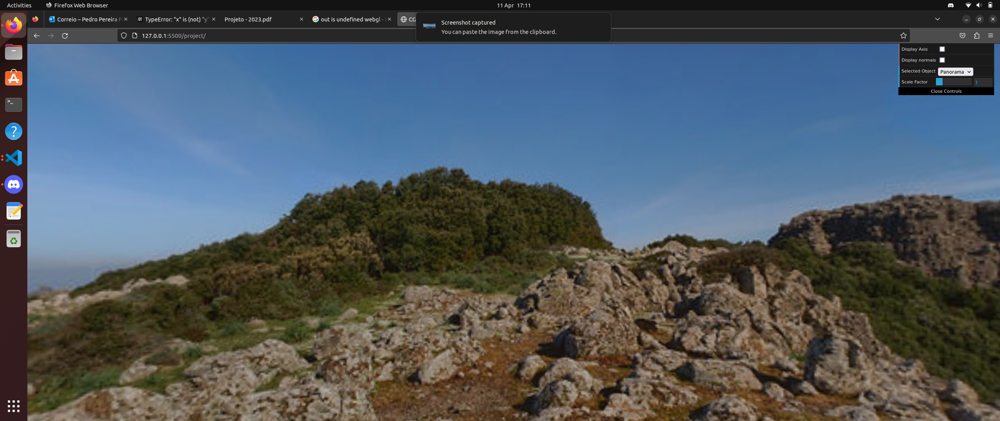
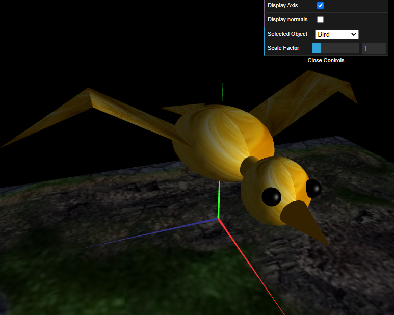
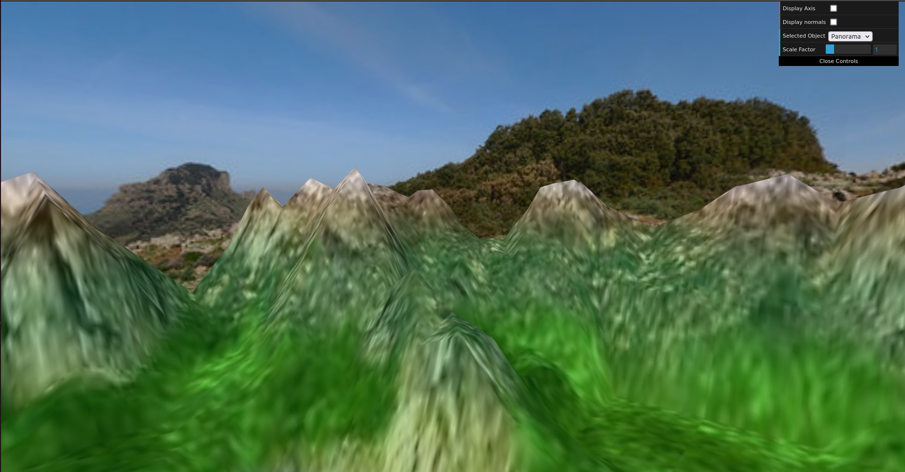
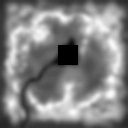
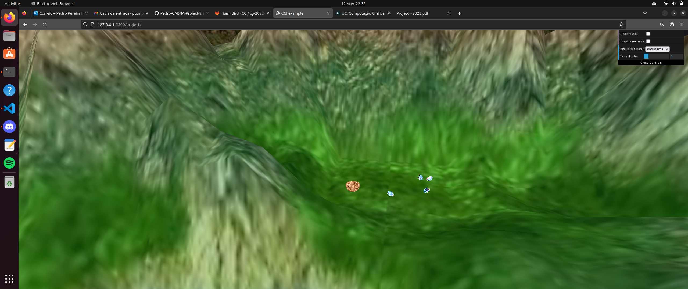

# CG 2022/2023

## Group T01G01

## Project

### Exercise 1

- The main goal of this exercise was to create a sphere using a variable number of slices and stacks. After that, we had also to apply a a texture on it.
- This was not difficult at all- if we analysed the exercise carefully, this one was preety similar to the creation of a prism in TP3, also using slices and stacks. However, there was a small difference on this task, which was the increment of the vertices- they were varying in 180 degrees and 90 degrees, in slices and stacks respectively. Finally, we had to apply the texture given, using the techniques learnt in the previous TP classes, which there were no difficulties. As a result, we completed this task successfully.

### Exercise 2

- In this exercise we had to create a panorama, using the sphere created in the previous exercise. What we needed to do was to invert the the normal vectores and the sphere's vertices, so that we could see to the its interior, besides the addition of another texture. Then, we had to apply the tranformations in order to make it bigger and also position with the coordinates of the scene's camera, using the techniques learnt in the first TP classes. The result is shown below:

## Exercise 3

- In this part, we had to create a bird that will be living in our world. In order to do that, we created each bird's parts (wing, body, etc.), which consisted in the joint of basic objects, such as spheres, triangles and rectangles. In addition of that, we also created a texture to it. The bird is shown below:

- Its movement is under development by now.

## Exercise 4

- In this part, we had to create a terrain that will substitute the existent plane. Even though this terrain is based on the plane, we had to modify it in order to give the perspective of elevation. In order to do that we had to create a vert and a frag shader so that we could modify the colors and the vertexs' positions. The result is shown below:

## Exercise 5

- In this part, we had to integrate a couple of eggs and the bird's nest in the terrain. In order to do that, we decided to make this aproach:

1) Create the Egg instance;
2) "Populate" the terrain with eggs;
3) Create the Nest instance;
4) Put nest in the terrain;

- In the first point we simply use the Sphere instance and apply to it some scale operations and we obtained the egg successfully. However, this was not the difficult part, but the terrain "population" was.

- This was the one of the most difficult parts of the project, since we had to consider various positions for the eggs, all of them different from each other. 

- Firstly, we had to create a highplane, in order to put them in the terrain. We started to modify the heightmap and put there a 20x20 black square, near the river. However, this makes the that zone was on the same height of the bottom of the lake, which was not supposed to happen. In order to solve the problem we used an intermediate grey so it could be in a intermediate height. The final height map is shown below:

- With the highplane created, we had to insert the eggs there, and is was when we struggled- since we had to find correct value of y, so any egg could be right above the surface in any position or rotation and they belonged to space limited by the highplane. We did that by trial error.

- Finally, we simply had to create the Nest instance and put it in the highplane. The instance was not difficult at all, since it could be seen as semicircle; however, its code could be improved. Besides that, we had to apply the nest texture and rotation operation as well. The correct values of coordinates were obtained in the same approach as eggs (trial error). The final result is shown below:

- The final movement of the bird is still under development.