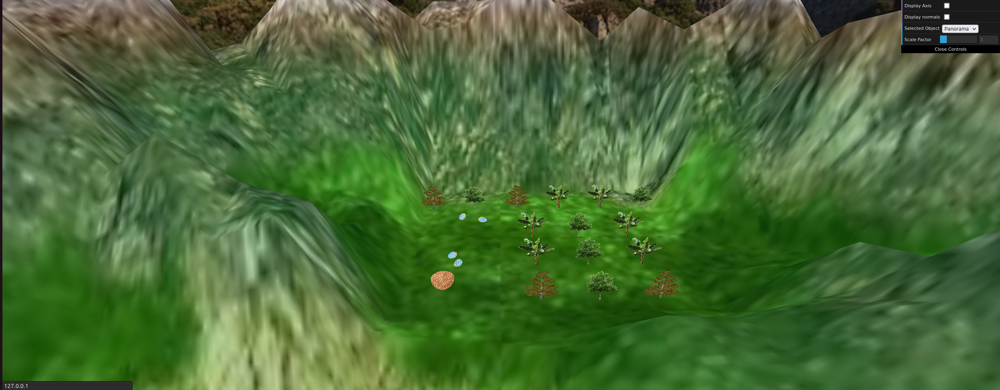

# CG 2022/2023

## Group T01G01

## Project

### Phase 1 - Creating a Sphere

- The main goal of this exercise was to create a sphere using a variable number of slices and stacks. After that, we had also to apply a a texture on it.
- This was not difficult at all- if we analysed the exercise carefully, this one was preety similar to the creation of a prism in TP3, also using slices and stacks. However, there was a small difference on this task, which was the increment of the vertices- they were varying in 180 degrees and 90 degrees, in slices and stacks respectively. Finally, we had to apply the texture given, using the techniques learnt in the previous TP classes, which there were no difficulties. As a result, we completed this task successfully.

### Phase 2 - Panorama Creation

- In this exercise we had to create a panorama, using the sphere created in the previous exercise. What we needed to do was to invert the the normal vectores and the sphere's vertices, so that we could see to the its interior, besides the addition of another texture. Then, we had to apply the tranformations in order to make it bigger and also position with the coordinates of the scene's camera, using the techniques learnt in the first TP classes. The result is shown below:

### Phase 3 - The Bird

- In this phase, we developed a Bird object composed of simpler objects (namely eyes, neck, beak, wings, torso, tail and head). The wings are composed of a triangle and a rectangle. The eyes, body and head use the same sphere (with different scaling adjustments). The tail is a triangle, the beak is a cone and the neck is a cylinder. We also added a texture to the bird, making it look like the image below:

- After having our bird model, we started working on its animations. We started by developing the vertical oscillation the bird suffers while flying, making it move slightly up and down as a whole in a movement that is repeated every second. We also animated the wings and tail to simulate the flight of a real bird, by rotating each body part, using an algorithm that calculates the position of each body part considering the time elapsed since the app has been started. The wings also fold slightly in the middle.

- The bird's movement was done using the trigonometric circle logic, multiplying the vector by the speed factor which can be manually adjusted by the user. This value also effects the animations. the dive movement was also implemented, working either when the bird is accelerating or when it's not moving. Lastly, the speed factor also effects the rotation speed.

- As for the interaction between the bird and the eggs, we had some trouble implementing the way the bird picks the egg from the ground and the way it drops it, mainly because of some errors in the array where the eggs were stored.

## Phase 4 - Terrain

- In this part, we had to create a terrain that will substitute the existent plane. Even though this terrain is based on the plane, we had to modify it in order to give the perspective of elevation. In order to do that we had to create a vert and a frag shader so that we could modify the colors and the vertexs' positions. The result is shown below:

## Phase 5 - The Eggs

- In this part, we had to integrate a couple of eggs and the bird's nest in the terrain. In order to do that, we decided to make this aproach:

1) Create the Egg instance;
2) "Populate" the terrain with eggs;
3) Create the Nest instance;
4) Put nest in the terrain;

- In the first point we simply use the Sphere instance and apply to it some scale operations and we obtained the egg successfully. However, this was not the difficult part, but the terrain "population" was.

- This was the one of the most difficult parts of the project, since we had to consider various positions for the eggs, all of them different from each other. 

- Firstly, we had to create a highplane, in order to put them in the terrain. We started to modify the heightmap and put there a 20x20 black square, near the river. However, this makes the that zone was on the same height of the bottom of the lake, which was not supposed to happen. In order to solve the problem we used an intermediate grey so it could be in a intermediate height. The final height map is shown below:

- With the highplane created, we had to insert the eggs there, and is was when we struggled- since we had to find correct value of y, so any egg could be right above the surface in any position or rotation and they belonged to space limited by the highplane. We did that by trial error.

- Finally, we simply had to create the Nest instance and put it in the highplane. The instance was not difficult at all, since it could be seen as semicircle; however, its code could be improved. Besides that, we had to apply the nest texture and rotation operation as well. The correct values of coordinates were obtained in the same approach as eggs (trial error). The final result is shown below:

- The final movement of the bird is still under development.

## Phase 6 - Trees

- In this part we had to create trees in order to make a forest. This process was not difficult.

- Firstly, we had to create a Billboard, which will always rotate so that it could be seen at front by the camera. We followed the steps to calculate that the vectors, the angle and the rotation axis, and we had the desired effect. It was also important to make the Y component to 0.

- Secondly he had to choose 3 textures for the trees. Here are the chosen ones:

- First texture:

- Second texture:

- And the third texture:

- We used a random number generator between 1 to 3 in order to make the trees with different textures. 

- Finally, we had to create a Tree Patch and a Tree Row. The first we simply instatiate with 2 for-loops 9 trees and put them as a 3x3 matrix, which was not difficult at all. The Tree Row was easier- we simply needed a for-loop to put them in a row.

- We displayed them in our panorama and we noticed also that we had to resize our highplane, so every elements of the world could be visible. Here is the final result:

