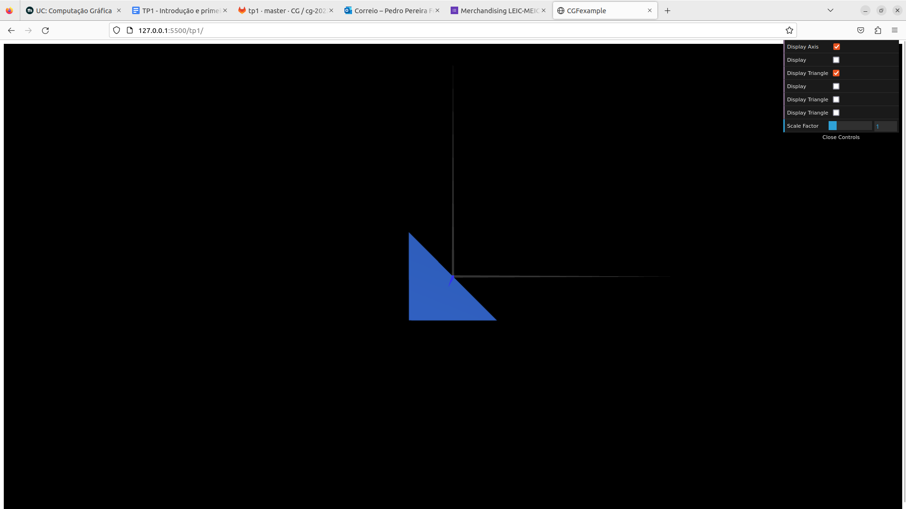
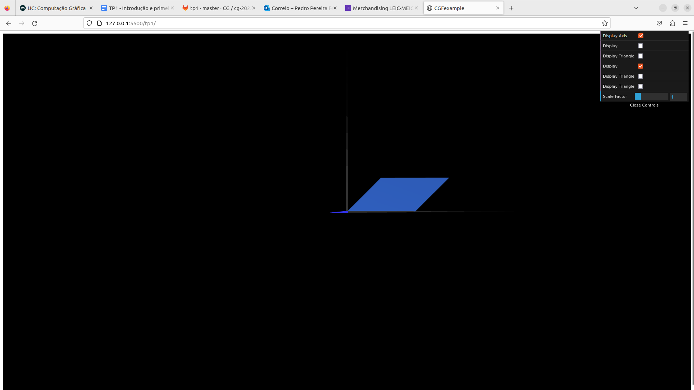
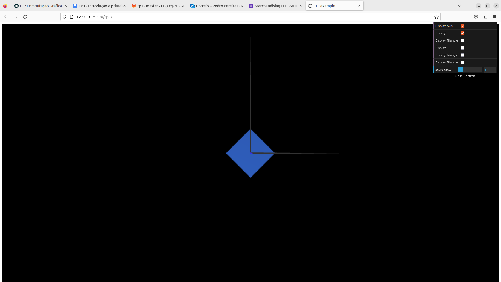
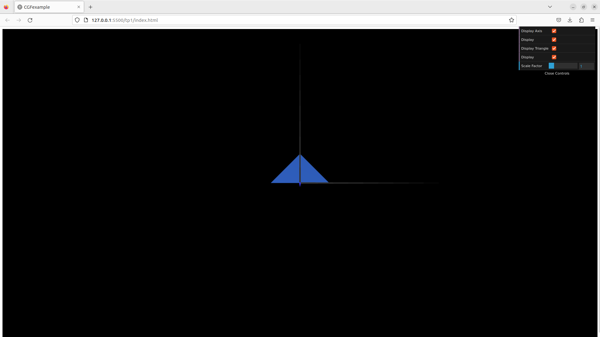
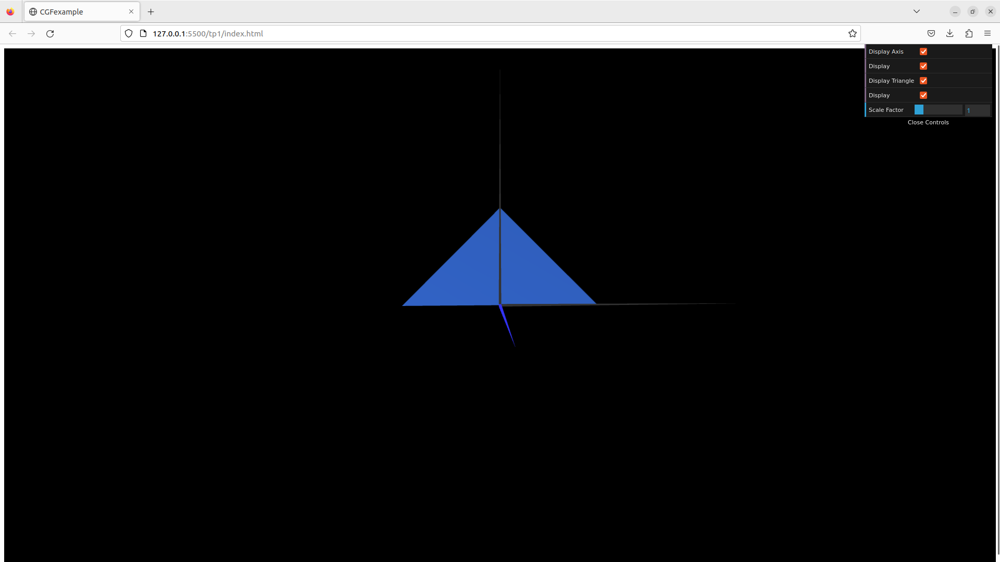

# CG 2022/2023

## Group T01G01

## TP 1 Notes

### Exercise 1
- We observed that it was possible to decompose the parallelogram into several triangles in order to create the object. 
- We also found many different ways of decomposing the figure into triangles, some with more triangles than others.
- Finally, we also understood that, in order to make an object visible from both sides, we need to specify the indexes for the vertices both in clockwise and counter-clockwise order. One of the sides will, of course, seem darker than the other because it's not facing the only enabled light source.

Here are some examples of the figures we've created:

### Exercise 2

- In exercise 2, we had to draw 2 different triangles which were shown in the image CG-t01-g01-tp1-5 and CG-t01-g01-tp1-6. 

- We didn't feel some major difficulties, since we've done a similar triangle in Exercise 1. However, we understood how to create and display different figures in WebCGL.

