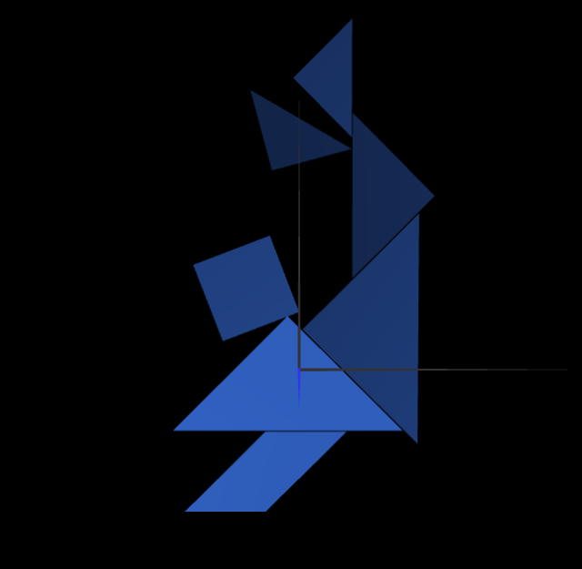
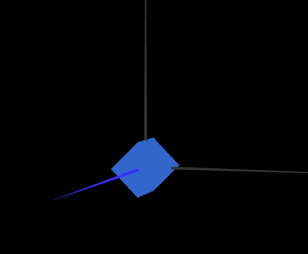
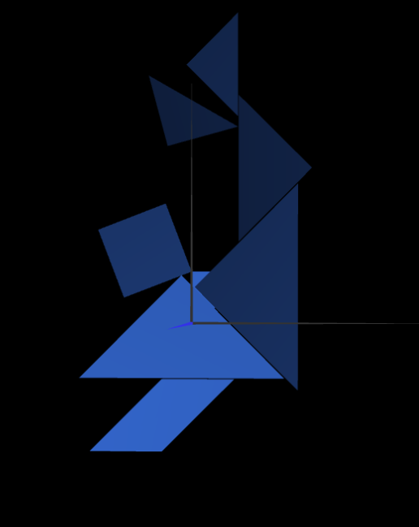
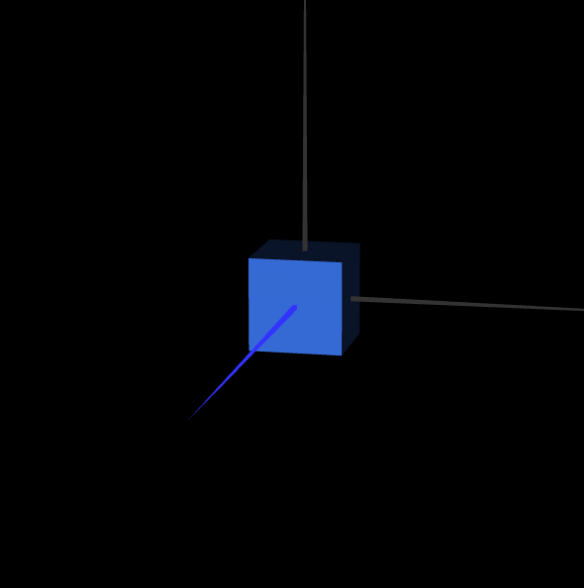

# CG 2022/2023

## Group T01G01

## TP 2 Notes

### Exercise 2

- The main goal of this exercise was to replicate a tangram figure by our choice. The figure chosen is shown below:

- In order to complete, we built each piece of the tangram with the help of the figures created in the last TP. Besides that, we had to made the correct translations and rotations, in the correct order, to replicate our figure. This exercise wasn't that difficult, so we made each steps smoothly. The result is shown below:

Here are some examples of the figures we've created:

### Exercise 3

- In exercise 3, we had to draw a unitary cube and add it to our tangram. Besides that, we had also to make them parallel to XZ plan.

- The cube was not difficult to build, so we dind't have any problem there.

- After that, we had to add our cube to the tangram. That was also easy, since we simply had to add the cube to our figure. It looked like this:

- Finally, we had to rotate to make it parallel to plan XZ. Doing that was not difficult at all, since it is only necessary to make a rotation; however, we felt some difficulties to understand in which axis we had to do that rotation, and we concluded that we had to make it in turn of X axis. The final result is shown below:

### Exercise 4

- In the last exercise, we had to built a cube made with several plans. It was not difficult at all, since we only had to put the plans in the correct position. The result is shown below:

