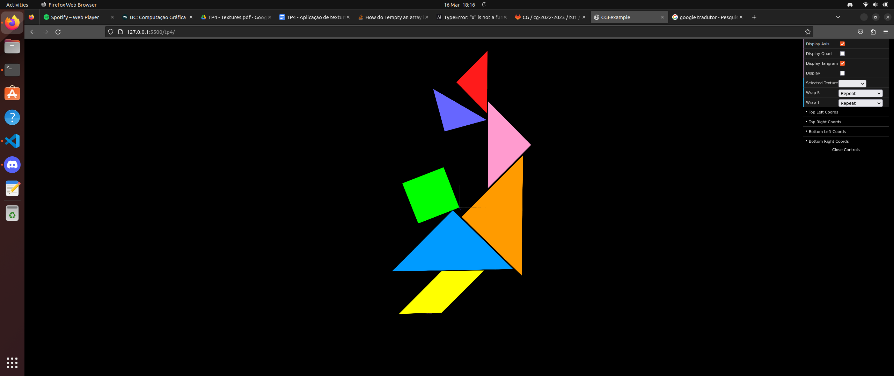

# CG 2022/2023

## Group T01G01

## TP 4 Notes

### Exercise 1

- The main goal of this exercise was to understand how we can create a texture using an image. For that, we were asked to add the respective tangram textures to each piece of our tangram.

- In order to do that, it was mandatory to create the texture's coordinates, so that WebGL knows in what "points" of the image should use to delimit it and fill the various figures, which wasn't a problem at all, thanks to "tangram-lines.png" image. Here is the final result:

### Exercise 2

- In progress.
