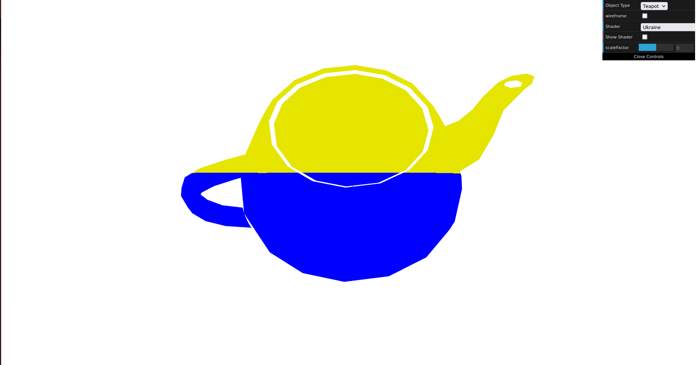
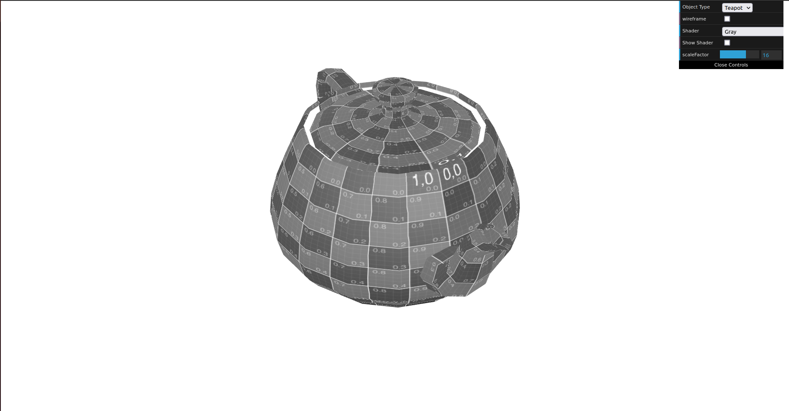
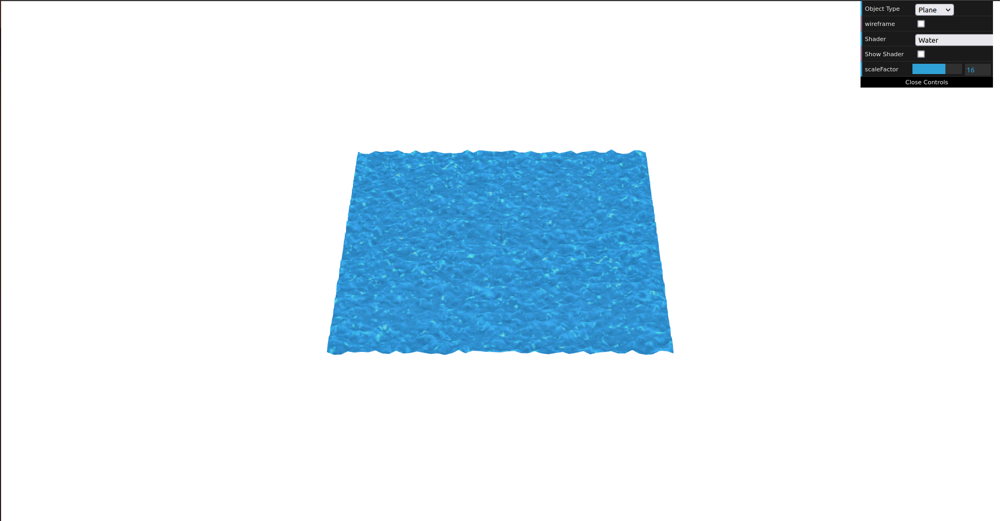

# CG 2022/2023

## Group T01G01

## TP 5 Notes

### Exercise 1

- The main goal of this exercise was to understand how we can create a shader. To complete this exercise, we need to create the Ukraine flag in a teapot, by separating it in 2 halves, according to line y = 0.5. The main difficulty was to understand what were the correct methods to be used. The final result is shown below:

- Besides that, we needed to animate and make it move forward and backwards along the X axis. Finally, we had to addapt the Sepia shader, and put in the teapot with a specified gray scale. Here is the final result:

### Exercise 2

- The goal of this exercise was to create a texture with the water effect. To do that, we had to adapt the texture2 shader and use in the water texture. The most important thing was the water motion effect, which was obtained by ordinates altern along time between -1 and 1. Here is the result:

